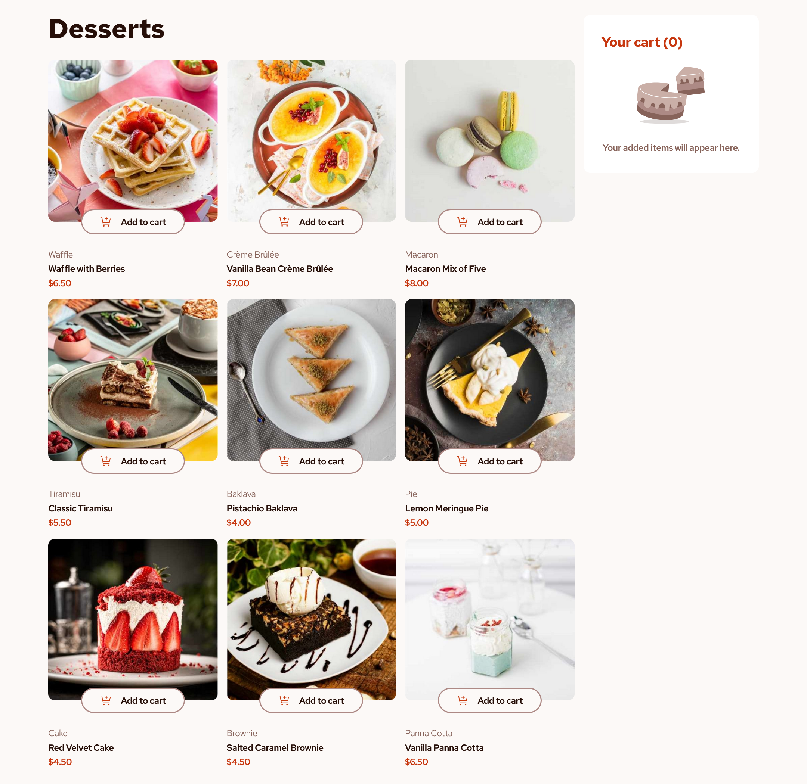
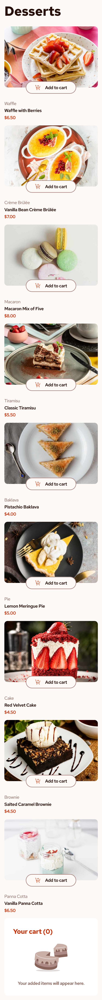

# Frontend Mentor - Product list with cart solution

This is a solution to the [Product list with cart challenge on Frontend Mentor](https://www.frontendmentor.io/challenges/product-list-with-cart-5MmqLVAp_d). Frontend Mentor challenges help you improve your coding skills by building realistic projects.

## Table of contents

- [Overview](#overview)
  - [The challenge](#the-challenge)
  - [Screenshots](#screenshots)
  - [Links](#links)
- [My process](#my-process)
  - [Built with](#built-with)
  - [Getting Started](#getting-started)
  - [What I learned](#what-i-learned)
  - [Continued development](#continued-development)
  - [Useful resources](#useful-resources)
- [Author](#author)
- [Acknowledgments](#acknowledgments)

**Note: Delete this note and update the table of contents based on what sections you keep.**

## Overview

### The challenge

Users should be able to:

- Add items to the cart and remove them
- Increase/decrease the number of items in the cart
- See an order confirmation modal when they click "Confirm Order"
- Reset their selections when they click "Start New Order"
- View the optimal layout for the interface depending on their device's screen size
- See hover and focus states for all interactive elements on the page

### Screenshots




### Links

- Solution URL: [Github Repository](https://github.com/vickbk/product-list-with-cart)
- Live Site URL: [Hosted on github pages](https://your-live-site-url.com)

## My process

### Built with

- Semantic HTML5 markup
- CSS custom properties
- SASS - CSS Preprocessor
- Tailwindcss - CSS frameword
- Mobile-first workflow
- [React](https://reactjs.org/) - JS library
- [Vite](https://vite.dev/) - A build tool for the web

### Getting started

- Install the dependancies
  ```bash
  pnpm install
  ```
- Start the server
  ```bash
  pnpm dev
  ```
- Build a production preview
  ```bash
  pnpm build
  ```
- Preview the built file
  ```bash
  pnpm preview
  ```

### What I learned

I this section I improved my understanding of the react useContext Hook as it helps fix the prop drilling issue which comes with props passing from far parent to far deep children.

Before I would get pissed off with that and code could become unreadable... Now I am glad to have learnt something that helps me with that process.

```js

// Just for the sake of brievety

export const MyContext = createContext([]);

export const MyParentComponent = ({children}) => {
  const context = useContext(MyContext);
  return (<MyContext value={[1,2,4]}>
    {children}
  </MyContext>)
}

export const MyFarChild = () => {
  const context = useContext(MyContext);
  return (<ul>
  {
    context.map((num) => <li>{num}</li>);
  }
  </ul>);
}
```

### Continued development

After this project, I will continue to read best practices for React, I also didn't implement unit testing for separate components which will be my focus from now on going

### Useful resources

- [Roadmap](https://roadmap.sh) - Helped me get started with this journey and still leading me throughout the process
- [Frontend Mentor](https://www.frontendmentor.io) - Currently working with frontend mentor is upskilling me and I want to learn more here... Im not yet to leave

## Author

- Github - [@vickbk](https://github.com/vickbk)
- Frontend Mentor - [@vickbk](https://www.frontendmentor.io/profile/vickbk)
- Twitter - [@Vick_bk8](https://x.com/Vick_bk8)

## Acknowledgments

For this project I use most of the knowlegde I got from the frontend roadmap, frontendmentor for HTML & css tricks and technics, accessibility and various developement techniques...
